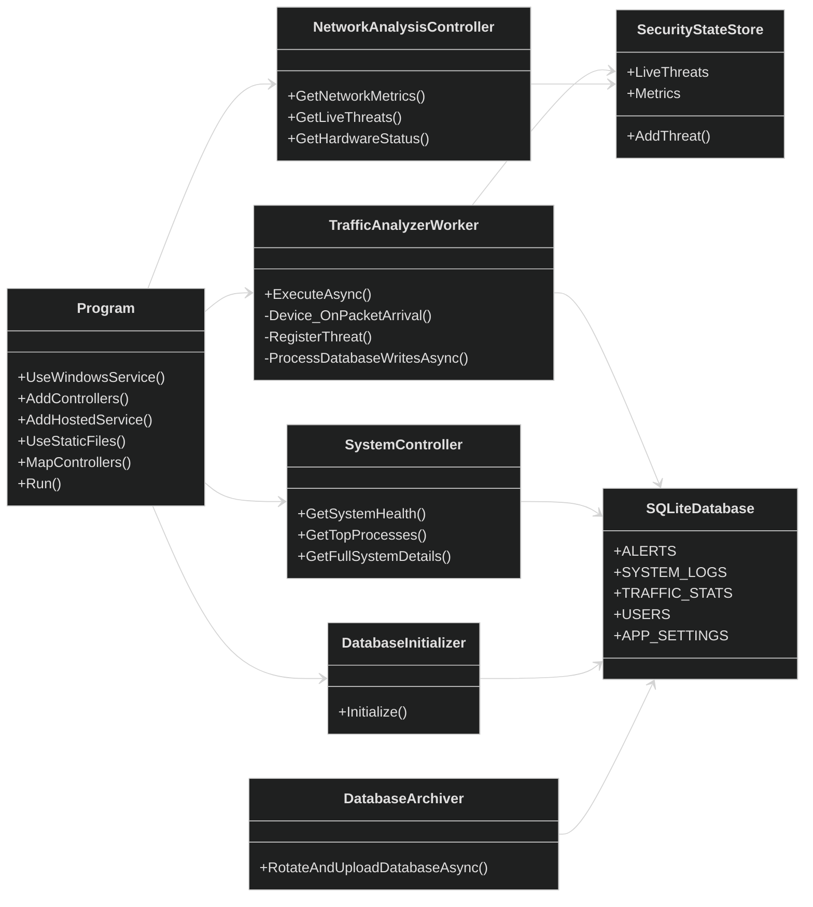

# WatchMan

Watchman, Windows üzerinde çalışan bir sistem ve ağ güvenliği izleme uygulamasıdır. Proje; arka planda çalışan bir Windows Service, ASP.NET Core tabanlı REST API, SQLite veritabanı, canlı ağ trafiği analizi ve web dashboard yapısını tek bir uygulama altında toplamayı hedefler.

Uygulama; sistem sağlığı, ağ trafiği, canlı tehdit tespiti, log yönetimi, kullanıcı yönetimi ve temel dashboard ayarlarını merkezi bir yapı üzerinden takip etmek için geliştirilmiştir.

---

## İçindekiler

- [Proje Amacı](#proje-amacı)
- [Temel Özellikler](#temel-özellikler)
- [Kullanılan Teknolojiler](#kullanılan-teknolojiler)
- [Proje Mimarisi](#proje-mimarisi)
- [Klasör Yapısı](#klasör-yapısı)
- [Veritabanı Yapısı](#veritabanı-yapısı)
- [Kurulum](#kurulum)
- [Projeyi Çalıştırma](#projeyi-çalıştırma)
- [Windows Service Olarak Çalıştırma](#windows-service-olarak-çalıştırma)
- [API Yapısı](#api-yapısı)
- [Dashboard](#dashboard)
- [Geliştirici Notları](#geliştirici-notları)
- [Katkı Süreci](#katkı-süreci)

---

## Proje Amacı

Watchman Preprod, yerel sistem üzerinde çalışan güvenlik ve sistem izleme servisidir. Uygulamanın temel amacı, ağ trafiğini analiz ederek şüpheli aktiviteleri tespit etmek, sistem kaynaklarını takip etmek ve elde edilen verileri dashboard üzerinden yönetilebilir hale getirmektir.

Bu proje özellikle aşağıdaki ihtiyaçlara odaklanır:

- Ağ trafiği takibi
- Şüpheli bağlantı ve paket davranışı tespiti
- Sistem sağlık durumunun izlenmesi
- Logların merkezi olarak tutulması
- Dashboard üzerinden okunabilir güvenlik görünümü sağlanması
- Windows Service olarak sürekli arka planda çalışabilme

---

## Temel Özellikler

- ASP.NET Core tabanlı REST API
- Windows Service entegrasyonu
- SQLite tabanlı yerel veritabanı
- Npcap / SharpPcap ile ağ paketi yakalama altyapısı
- Canlı ağ metrikleri
- Tehdit olaylarının RAM üzerinde tutulması
- Tespit edilen olayların veritabanına yazılması
- Sistem sağlık bilgileri
- CPU, RAM, disk ve process takibi
- Kullanıcı girişi ve rol yapısı
- Uygulama ayarlarının veritabanında saklanması
- Log görüntüleme ve silme altyapısı
- Statik web dashboard dosyalarını sunma desteği

---

## Kullanılan Teknolojiler

| Teknoloji | Açıklama |
|---|---|
| C# | Ana geliştirme dili |
| .NET / ASP.NET Core | Web API ve servis altyapısı |
| Windows Service | Uygulamanın arka planda servis olarak çalışması |
| SQLite | Yerel veritabanı |
| Npcap | Ağ paketi yakalama sürücüsü |
| SharpPcap | .NET üzerinden paket yakalama işlemleri |
| PacketDotNet | Yakalanan paketlerin analiz edilmesi |
| HTML / Static Web | Dashboard arayüzü |
| Mermaid | UML ve mimari diyagram gösterimi |

---

## Proje Mimarisi

Proje genel olarak aşağıdaki katmanlardan oluşur:

```text
Dashboard / Web UI
        |
        v
ASP.NET Core API Controllers
        |
        v
Services / State Store
        |
        v
Background Workers
        |
        v
Npcap / SharpPcap / PacketDotNet
        |
        v
SQLite Database
```

### Ana Bileşenler

| Bileşen | Açıklama |
|---|---|
| `Program.cs` | Uygulamanın başlangıç noktasıdır. Servisleri, controller yapılarını, CORS ayarlarını, statik dosya sunumunu ve veritabanı başlangıcını yapılandırır. |
| `Controllers` | API endpointlerini içerir. Dashboard ve dış istemciler bu endpointler üzerinden veri alır. |
| `Workers` | Arka planda çalışan servisleri içerir. Ağ trafiği analizi gibi sürekli çalışan işlemler burada yer alır. |
| `Services` | Ortak state, metrik ve canlı veri yönetimi için kullanılan servisleri içerir. |
| `Data` | Veritabanı başlatma, arşivleme ve veri işlemleriyle ilgili yardımcı sınıfları içerir. |
| `Driver` | Npcap sürücüsü kontrolü ve kurulumu ile ilgili işlemleri içerir. |
| `Models` | API, metrik ve veri modellerini içerir. |
| `wwwroot` | Dashboard için statik web dosyalarını barındırır. |

---

## Klasör Yapısı

```text
WatchMan/
│
├── Controllers/
│   ├── NetworkAnalysisController.cs
│   └── SystemController.cs
│
├── Data/
│   ├── DatabaseArchiver.cs
│   └── DatabaseInitializer.cs
│
├── Driver/
│   └── NpcapInstaller.cs
│
├── Models/
│
├── Properties/
│
├── Services/
│
├── Web/
│
├── Workers/
│   └── TrafficAnalyzerWorker.cs
│
├── wwwroot/
│
├── Program.cs
├── Worker.cs
├── Watchman.csproj
├── Watchman.slnx
├── appsettings.json
├── appsettings.Development.json
├── base-db.sql
└── .gitignore
```

---

## Veritabanı Yapısı

Proje SQLite veritabanı kullanır. İlk çalıştırmada `base-db.sql` dosyası üzerinden gerekli tablolar oluşturulur.

Veritabanında yer alan ana tablolar:

### `ALERTS`

Güvenlik uyarılarının tutulduğu tablodur.

| Kolon | Açıklama |
|---|---|
| `Id` | Birincil anahtar |
| `AlertType` | Alarm tipi |
| `Severity` | Önem seviyesi |
| `SourceIp` | Kaynak IP adresi |
| `TargetPort` | Hedef port |
| `Description` | Açıklama |
| `Module` | Alarmı oluşturan modül |
| `CreatedAt` | Oluşturulma zamanı |
| `IsResolved` | Çözüldü bilgisi |

### `SYSTEM_LOGS`

Sistemden toplanan kritik logların tutulduğu tablodur.

| Kolon | Açıklama |
|---|---|
| `Id` | Birincil anahtar |
| `EventId` | Windows event ID |
| `Provider` | Log sağlayıcısı |
| `Message` | Log mesajı |
| `CreatedAt` | Oluşturulma zamanı |

### `TRAFFIC_STATS`

Ağ trafiği istatistiklerinin tutulduğu tablodur.

| Kolon | Açıklama |
|---|---|
| `Id` | Birincil anahtar |
| `Timestamp` | Kayıt zamanı |
| `TotalPackets` | Toplam paket sayısı |
| `TotalBytes` | Toplam byte miktarı |
| `DroppedPackets` | Düşen paket sayısı |

### `USERS`

Dashboard kullanıcılarının tutulduğu tablodur.

| Kolon | Açıklama |
|---|---|
| `Id` | Birincil anahtar |
| `Username` | Kullanıcı adı |
| `PasswordHash` | Şifre hash değeri |
| `Role` | Kullanıcı rolü |
| `LastLogin` | Son giriş zamanı |

### `APP_SETTINGS`

Uygulama ayarlarının tutulduğu tablodur.

| Kolon | Açıklama |
|---|---|
| `Id` | Birincil anahtar |
| `SettingKey` | Ayar anahtarı |
| `SettingValue` | Ayar değeri |

Varsayılan ayarlar arasında log saklama süresi, uzak log sunucusu adresi ve tema bilgisi bulunur.

---

## Kurulum

### Gereksinimler

Projeyi çalıştırmak için aşağıdaki gereksinimlere ihtiyaç vardır:

- Windows işletim sistemi
- .NET SDK
- Visual Studio veya Visual Studio Code
- Npcap
- Git

> Not: Proje ağ paketi yakalama işlemleri yaptığı için yönetici izni gerekebilir.

---

### 1. Repoyu Klonla

```bash
git clone https://github.com/freed0M13/WatchMan.git
cd WatchMan
```

---

### 2. Bağımlılıkları Yükle

```bash
dotnet restore
```

---

### 3. Projeyi Derle

```bash
dotnet build
```

---

## Projeyi Çalıştırma

Geliştirme ortamında projeyi çalıştırmak için:

```bash
dotnet run
```

Uygulama çalıştığında ASP.NET Core API ayağa kalkar, statik dashboard dosyaları servis edilir ve arka plan servisleri başlatılır.

Varsayılan olarak uygulama adresi `appsettings.json` veya launch ayarlarına göre belirlenir.

---

## Windows Service Olarak Çalıştırma

Proje Windows Service olarak çalışacak şekilde tasarlanmıştır.

### 1. Yayınlama

```bash
dotnet publish -c Release -o publish
```

### 2. Servis Oluşturma

PowerShell'i yönetici olarak açıp aşağıdaki komutu çalıştır:

```powershell
sc.exe create WatchmanSecurityService binPath= "C:\path\to\watchman-preprod\publish\Watchman.exe"
```

### 3. Servisi Başlatma

```powershell
sc.exe start WatchmanSecurityService
```

### 4. Servisi Durdurma

```powershell
sc.exe stop WatchmanSecurityService
```

### 5. Servisi Silme

```powershell
sc.exe delete WatchmanSecurityService
```

---

## API Yapısı

Projedeki controller yapısı dashboard ve servis yönetimi için REST API sağlar.

### Network Analysis API

Ağ trafiği ve tehdit durumunu görüntülemek için kullanılır.

Örnek endpointler:

```http
GET /api/networkanalysis/metrics
GET /api/networkanalysis/threats
GET /api/networkanalysis/hardware
```

### System API

Sistem sağlık durumunu, process bilgilerini ve donanım metriklerini görüntülemek için kullanılır.

Örnek endpointler:

```http
GET /api/system/health
GET /api/system/processes
GET /api/system/full
```

### Auth API

Dashboard kullanıcı girişi ve kullanıcı yönetimi için kullanılır.

Örnek endpointler:

```http
POST /api/auth/login
GET /api/auth/users
POST /api/auth/create-user
```

### Logs API

Sistem, trafik ve güvenlik loglarını yönetmek için kullanılır.

Örnek endpointler:

```http
GET /api/logs
DELETE /api/logs
POST /api/logs/send-remote
```

### Settings API

Ağ arayüzleri ve uygulama ayarlarını yönetmek için kullanılır.

Örnek endpointler:

```http
GET /api/settings/interfaces
GET /api/settings
POST /api/settings
```

---

## Dashboard

Dashboard dosyaları `wwwroot` veya `Web` klasörleri üzerinden servis edilecek şekilde yapılandırılmıştır.

Uygulama çalıştığında:

- API endpointleri aktif olur.
- Statik dashboard dosyaları servis edilir.
- Canlı ağ metrikleri dashboard üzerinden görüntülenebilir.
- Tehdit kayıtları ve sistem durumu takip edilebilir.

---

## UML Diyagramı

Projeyi açıklamak için Mermaid tabanlı UML diyagramı kullanılabilir.



---

## Geliştirici Notları

### Veritabanı Başlatma

Uygulama ilk çalıştırmada `base-db.sql` dosyasındaki tablo yapılarını kullanarak veritabanı oluşturur.

### Npcap Kullanımı

Ağ trafiği analizi için Npcap gereklidir. Eğer sistemde Npcap kurulu değilse, proje içindeki sürücü kontrol mekanizması üzerinden kurulum kontrolü yapılır.

### Yetki Gereksinimi

Ağ paketlerini yakalamak ve sistem metriklerini okumak için uygulamanın bazı durumlarda yönetici izniyle çalıştırılması gerekebilir.

### Dashboard ve API Ayrımı

Dashboard statik dosya olarak servis edilir. API endpointleri ise controller katmanında yer alır. Bu yapı sayesinde frontend ve backend mantığı ayrılmış olur.

---

## Örnek Geliştirme Akışı

Projeyi geliştirmek isteyen bir ekip üyesi aşağıdaki akışı kullanabilir:

```bash
git clone https://github.com/freed0M13/WatchMan.git
cd watchman-preprod
dotnet restore
dotnet build
dotnet run
```

Değişiklik yaptıktan sonra:

```bash
git status
git add .
git commit -m "Açıklayıcı commit mesajı"
git pull origin main
git push origin main
```

Eğer uzak repoda yeni değişiklik varsa önce pull alınmalıdır:

```bash
git pull origin main
```

Çakışma oluşursa dosyalar düzenlenip tekrar commitlenmelidir.

---

## Güvenlik Notları

Bu proje güvenlik ve sistem izleme amacıyla geliştirilmiştir. Kullanım sırasında aşağıdaki noktalara dikkat edilmelidir:

- Veritabanı şifresi veya gizli anahtarlar doğrudan repoya yazılmamalıdır.
- Gerçek ortamda varsayılan kullanıcı bilgileri değiştirilmelidir.
- Dashboard API'leri production ortamında yetkisiz erişime kapatılmalıdır.
- CORS ayarları geliştirme ortamında geniş tutulabilir, ancak canlı ortamda sınırlandırılmalıdır.
- Log gönderimi yapılacak uzak sunucu güvenilir ve HTTPS destekli olmalıdır.
- Ağ paketi yakalama işlemleri yalnızca yetkili olunan sistemlerde kullanılmalıdır.

---

## Yol Haritası

Planlanabilecek geliştirmeler:

- JWT tabanlı kimlik doğrulama
- Rol bazlı yetkilendirme
- Daha detaylı saldırı tespit kuralları
- Dashboard grafiklerinin geliştirilmesi
- Log filtreleme ve arama sistemi
- Otomatik raporlama
- Uzak sunucuya güvenli log aktarımı
- Servis kurulum scripti
- Unit test ve integration test altyapısı
- CI/CD pipeline
